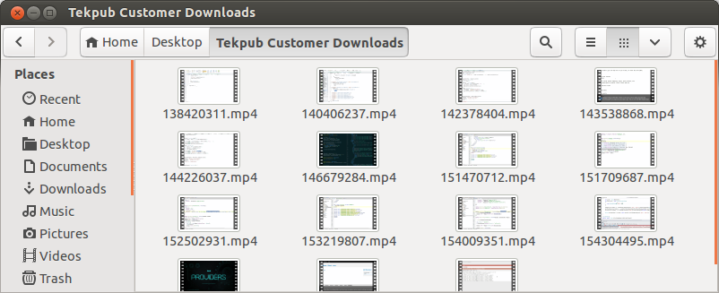

# tekpub-catcher

A cross-platform command-line tool (written in go) that downloads your Tekpub videos and gives them sensible names.

## Build Status

[](https://travis-ci.org/andreaskoch/tekpub-catcher)

## Motivation

[Tekpub](http://tekpub.com/) conveniently offers their customers to download the  video tutorials through an **RSS feed**. Unfortunately did they choose to give their video files **cryptic, meaningless and unsortable** names like "142378404.mp4" which give you no clue to which series a video belongs or in which order they should be played:



And that's why I have created this little tool. It will download your Tekpub videos and give sensible names.

## Features

tekpub-catcher can ...

1. download all items in your Tekpub subscription feed to a folder of your choice,
2. create a folder for each series (e.g. "Asynchronous C# 5.0 with Jon Skeet"),
3. give the individual video files a sensible name which can be sorted in ascending order (e.g "Asynchronous-C#-5.0-with-Jon-Skeet-001-A-Quick-Tour-of-Async-in-C#-5.mp4
")
4. and skip items which have already been downloaded.

... and it will be able to do that on the OS of your choice because it is written in [go](http://golang.org).

## Usage

To start the download of your Tekpub subscriptions you must specifiy two parameters:

1. `-feedurl`: The URL of your Tekpub Feed (which includes your subscription token)
2. `-downloadpath`: The directory path you want to download the files to

```bash
tekpub-catcher -downloadpath ~/Videos/Tekpub -feedurl http://delivery.tekpub.com/account/itunes.xml?token=<YourToken>
```

To stop the application after the current download has been finished simply write "stop" and hit `<Enter>`.

## Releases & Binaries

You can **download the binaries** for a lot of platforms and architectures from my [Amazon S3 "tekpub-catcher" Bucket](https://s3.amazonaws.com/andreaskoch/tekpub-catcher/v0.1.0/index.html) or directly from my Github release pages:

- [v0.1.0](https://github.com/andreaskoch/tekpub-catcher/releases/tag/v0.1.0)